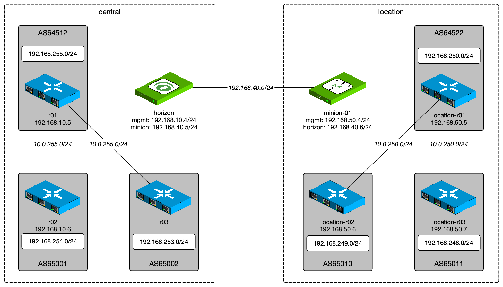

# BGP monitoring with BGP playground

DISCLAIMER: Requires snapshot container images from the [features/bmp](https://github.com/OpenNMS/opennms/tree/features/bmp) branch and is just for experimental usage.

This repository has a test environment to implement BGP monitoring using BMP protocol.
This environment provides the following network topology.



## Usage

Clone the repository and startup the application stack

```
cd bmp-playground
docker-compose up -d
```

Provision nodes and the GraphML network topologies

```
cd setup
./provision.sh
```

## Command examples

Administratively shutdown a peering session between r01 (AS64512) and r02 (AS65001)
```
docker-compose exec r01 gobgp neighbor 10.0.255.6 disable
```

Show BGP neighborhood status
```
docker-compose exec r01 gobgp neighbor
```
