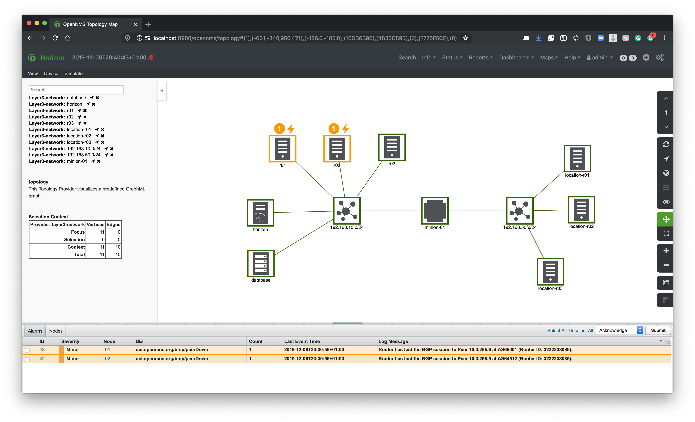
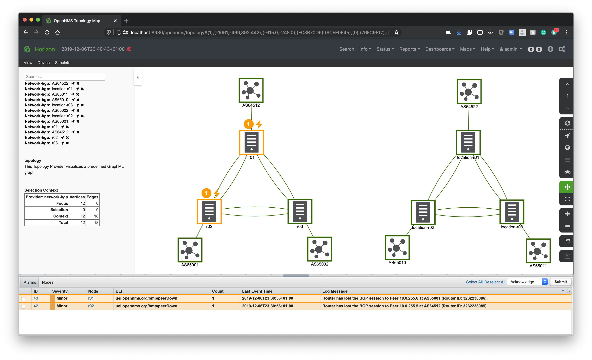

# Playground to monitor BGP with BMP

This repository has a test environment to implement BGP monitoring using BMP protocol.
This environment provides the following network topology.

There are two custom GraphML topologies provided:



## Layer 3 Network wiring and topology


**Addressing plan Data Center**

| Source         | Interface | IPv4           | Netmask bits |
|:---------------|:----------|:---------------|:-------------|
| cortex         | eth0      | 192.168.42.4   | 27           |
| database       | eth0      | 192.168.42.8   | 27           |
| sentinel-dc-12 | eth0      | 192.168.42.12  | 27           |
| core           | eth0      | 192.168.42.16  | 27           |
| grafana        | eth0      | 192.168.42.17  | 27           |
| minion-dc-20   | eth0      | 192.168.42.20  | 27           |
|                | eth1      | 192.168.42.36  | 27           |
| rt-dc-37       | eth0      | 192.168.42.37  | 27           |
|                | eth1      | 192.168.42.100 | 29           |
|                | eth2      | 192.168.42.108 | 29           |
| rt-dc-38       | eth0      | 192.168.42.38  | 27           |
|                | eth1      | 192.168.42.101 | 29           |
| rt-dc-39       | eth0      | 192.168.42.39  | 27           |
|                | eth1      | 192.168.42.109 | 29           |

**Addressing plan Location 01**

| Source         | Interface | IPv4            | Netmask bits |
|:---------------|:----------|:----------------|:-------------|
| minion-lo01-24 | eth0      | 192.168.42.24   | 27           |
|                | eth1      | 192.168.42.68   | 27           |
| rt-lo01-69     | eth0      | 192.168.42.69   | 27           |
|                | eth1      | 192.168.42.116  | 29           |
|                | eth2      | 192.168.42.124  | 29           |
| rt-lo01-70     | eth0      | 192.168.42.70   | 27           |
|                | eth1      | 192.168.42.117  | 29           |
| rt-lo01-71     | eth0      | 192.168.42.71   | 27           |
|                | eth1      | 192.168.42.125  | 29           |


BGP Topology



## Usage

Clone the repository and startup the application stack

```
cd bmp-playground
docker-compose up -d
```

Provision nodes and the GraphML network topologies

```
cd setup
./provision.sh
```

## Command examples

Administratively shutdown a peering session between r01 (AS64512) and r02 (AS65001)
```
docker-compose exec r01 gobgp neighbor 10.0.255.6 disable
```

Show BGP neighborhood status
```
docker-compose exec r01 gobgp neighbor
```

Add some routes
```
docker-compose exec r02 gobgp global rib add 10.36.0.0/16 -a ipv4
docker-compose exec location-r02 gobgp global rib add 10.37.0.0/16 -a ipv4
```


Debug and trigger statistics
```
admin@opennms()> log:set DEBUG org.opennms.netmgt.telemetry.protocols.bmp
admin@opennms()> bmp-stats-update
```
